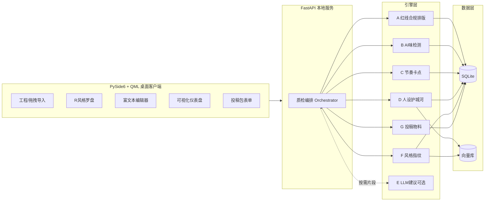
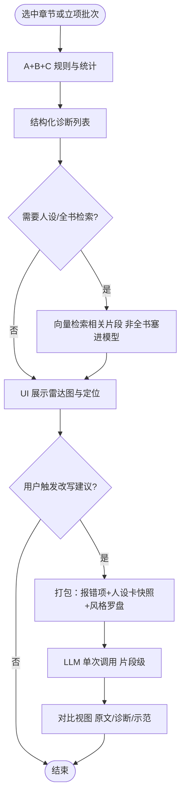
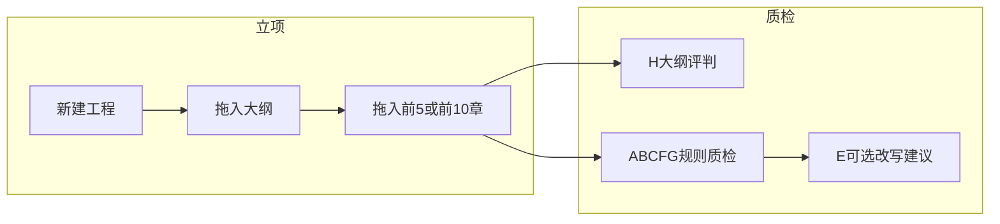

产品需求文档 (PRD)：七猫小说 AI 辅助预审与重构工具

版本： V2.5  
修订说明： V2.1 增补审核对齐指标、防上下文污染策略、数据合规 Plan B、投稿物料模块、用户旅程与非功能项；新增架构与功能简图（Mermaid）。V2.2：技术栈改为 Python 全栈（PySide6，废弃 Flutter/Dart）。V2.3：表现层明确为 Qt Quick / QML 为主。**V2.4：增加「小说立项」默认工作流——拖拽导入大纲与前五章/前十章，首批质检、评判与修改意见（模块 P、H）。** **V2.5：将「拖入大纲 + 拖入正文 → 输出评判标准与修改意见」固化为全产品核心模块（输入/输出契约、合并报告验收）。**

---

目标用户： 使用 AI 辅助创作，且主攻七猫等免费阅读平台的网文作者。

核心价值： 建立一套自动化质检流水线，提供跨平台桌面级 UI，解决 AI 生成小说“机翻味重、节奏平淡、偏离平台热门风格”的痛点，辅助稿件逼近平台商业化审稿偏好。**从「小说立项」起即可导入大纲与首批章节（如前 5 / 前 10 章），先做结构评判与正文质检，再输出可执行的修改意见。**本产品不承诺替代编辑终审或通过担保。

### 核心模块：拖拽大纲与正文 → 评判标准 + 修改意见

**定位**：全产品的能力锚点；风格罗盘、人设卡、LLM 改写等为增强能力，**不得弱化「导入即出标准与意见」这条主路径。**

| 契约项          | 说明                                                                                                                                                                                     |
| ------------ | -------------------------------------------------------------------------------------------------------------------------------------------------------------------------------------- |
| **输入**       | **大纲**：拖拽 `.md` / `.txt`（或多文件）入库；**小说正文**：拖拽文件夹或批量章节文件，按命名解析章序，可选范围（如前 5 / 前 10 章或自定义）。                                                                                                |
| **输出一：评判标准** | **预设、可追溯的判定依据**，不是散文式评语：每条结果须绑定 **严重度**（红 / 黄 / 绿）、**模块**（H / A～G / F）、**规则 ID**、**阈值来源**（风格罗盘 Golden Samples、回归校准集、内置默认）；大纲结构维度对应 **H1–H4**；与七猫审稿话术对齐见 **§3**。用户可在报告中展开「本次运行启用的标准清单」。 |
| **输出二：修改意见** | 在标准命中之上生成的**可执行反馈**：**章节级**问题摘要、**段落/句级**定位（章号 + 偏移或段落序号）、**修改方向**（删冗、加强冲突、补卡点等）；若启用模块 E，可在用户选中片段上附加「示范改写」，须仍引用对应规则 ID。**禁止**无规则锚点的空泛建议作为主交付物。                                         |
| **合并报告（验收）** | 单次质检输出一份结构化报告，固定包含：**① 评判标准清单（本次启用项）** → **② 命中表（规则 ID → 证据摘录 → 位置）** → **③ 修改意见列表（红先于黄先于绿，同级按章序）**；可选附录雷达图、情感曲线等可视化。                                                                  |

---

## 1. 架构总览 (System Architecture)

### 1.0 Python 全栈定位

- **实现语言统一为 Python**：桌面 UI 逻辑、本地服务、质检引擎、爬虫与 NLP 均在同一语言栈内维护，**不包含 Flutter / Dart**。
- **表现层推荐：PySide6 + Qt Quick / QML**：界面以 **声明式 QML** 为主（`QQmlApplicationEngine` 加载 `.qml`），便于实现 **圆角、动画、毛玻璃感、顺滑列表滚动** 等新潮客户端观感；业务对象通过 **上下文属性 / 注册 QObject** 暴露给 QML。
- **Qt Widgets 定位**：仅用于不适用 Quick 的边角场景（例如个别原生对话框或与第三方控件对接），**不作为主界面栈**。
- **正文编辑区（工程选型）**：优先 **Qt Quick Controls 2 的 `TextArea`** 做高颜值编辑器壳；若后续百万字性能或排版需求超出 Quick 文本控件能力，可采用 **QML 壳 + `QWebEngineView` 内嵌本地 HTML 编辑器** 或 **分块虚拟化** 等混合方案，待在 Phase 3 根据实测决策。
- **图表 / 仪表盘**：优先 **Qt Charts for Qt Quick** 或与 QML 结合的可视化方案；必要时 **QWebEngineView + ECharts（本地 HTML）**。
- **可选 UI 补充：Flet**——若需更快做出演示版，可用 Flet 做原型；与 PySide6+QML **不宜长期并行维护两套重度 UI**。
- **控制层**：FastAPI 作为 **本机 HTTP/WebSocket 服务**（`127.0.0.1`），由 PySide6 客户端调用；引擎亦可被 FastAPI **进程内 import** 同一套 Python 包，避免重复实现。

本系统采用 **Python 桌面客户端 + 本地 Python 微服务 + 引擎库** 架构：

| 层级                  | 说明                                                                     |
| ------------------- | ---------------------------------------------------------------------- |
| **表现层 (UI)**        | **PySide6 + Qt Quick / QML**：风格罗盘、编辑区、仪表盘、投稿包；动效与视觉以 QML 为主；可选 Flet 原型 |
| **控制层 (Local API)** | **FastAPI**：编排质检、隔离 LLM 长上下文调用；与 UI 通过本地端口通信                           |
| **引擎层**             | Python 包：规则校验、AI 味检测、风格指纹、可选爬虫、LLM 诊断与重构                               |
| **数据层**             | SQLite + 本地向量库：人设卡版本、风格指纹、质检报告快照                                       |

### 1.1 软件功能结构简图（模块视角）

### 1.2 质检流水线顺序（防串味）

---

## 2. 核心功能需求 (Functional Requirements)

### 2.0 模块 P：工程立项与批量导入（默认起点）

定义：用户从**新书立项**进入系统时的第一条路径——尚未全书完稿，先具备 **大纲 + 首批章节**，即可启动质检与评判。

| 编号     | 需求                                                                                                                                                                                            |
| ------ | --------------------------------------------------------------------------------------------------------------------------------------------------------------------------------------------- |
| **P1** | **新建工程**：书名、题材、目标站点（七猫子类）、关联风格罗盘；可选空白人设卡占位。                                                                                                                                                   |
| **P2** | **大纲导入**：支持拖拽 `**.md` / `.txt`**（或多文件合并）；启发式解析卷/章标题、序号；大纲文本入库并生成目录树。                                                                                                                          |
| **P3** | **章节批量导入**：拖拽文件夹或连续文件，识别「第 N 章」「chapter」等命名；用户可选首批范围预设：**前 5 章** / **前 10 章** / 自定义章列表。                                                                                                       |
| **P4** | **导入校验**：重复章节号告警；大纲中存在但正文缺失的章节标记「待写」；正文超出大纲范围的章节黄灯提示。                                                                                                                                         |
| **P5** | **首批质检套餐（Orchestrator 预设）**：一键选择 **「仅大纲评判」** / **「大纲 + 第 1 章」** / **「大纲 + 黄金三章」** / **「大纲 + 前五章」** / **「大纲 + 前十章」**；按套餐依次调用 **大纲评审（下表 H）** + **A～G（已有正文）**，输出合并报告，结构须符合上文 **「核心模块」合并报告（验收）**。 |
| **P6** | **交付一致性**：UI 主按钮文案与报告导出（PDF/HTML/Markdown 占位）须体现 **「评判标准 + 修改意见」** 双栏或双章节，避免仅导出闲聊式总评。                                                                                                         |

#### 大纲结构评审（模块 H，与立项同期）

定义：在正文不全或仅导入大纲阶段，仍给出**编辑向的结构意见**，与章节质检互补。

| 编号     | 需求                                                                                           |
| ------ | -------------------------------------------------------------------------------------------- |
| **H1** | **层级与完整性**：卷/章标题是否清晰；建议最少章节数以匹配所选题材常见体量（可配置占位）。                                              |
| **H2** | **主线可见性**：从大纲文本抽取主线/冲突关键词；与所选 **七猫子类** 标签做弱匹配（关键词重合度），不匹配则黄灯。                                |
| **H3** | **黄金三章映射**：检测大纲前段是否出现「开篇钩子 / 第一个冲突 / 第一个爽点或反转」的**事件节点描述**（启发式 + 可选 LLM 摘要）；缺失则提示「开篇可能在正文失控」。 |
| **H4** | **大纲与正文一致性**：若已导入对应章节，抽样比对章节剧情是否偏离纲要标题（轻量向量或关键词重叠）。                                          |

### 2.1 模块 F：七猫实时风格罗盘

定义：分析七猫各分类热门作品的表层特征，供用户切换检测基准。

- **F1** 榜单与样本扫描（实现细则见 **§7 数据合规**）。
- **F2** 风格切换后，阈值（句长、段落长度、对话占比等）与可选 LLM Prompt 模板对齐所选子类。

### 2.2 模块 A：基础合规与排版引擎（红线区）

- **A1** 敏感词过滤：Aho-Corasick，三级词库，上下文白名单。
- **A2** 排版格式化：段首空格、超长段落切分、引号统一。

### 2.3 模块 B：“AI 味”与行文质感（黄线区）

- **B1** 句式长度波动率（Variance）。
- **B2** AI 高频过渡词库高亮。
- **B3** 动词/形容词比例（Visual Index）。
- **B4**（增补）**流水账 / 编辑腔** 启发式：超长说明段连续出现、情感抽象词堆叠 —— 与 AI 味区分告警。

### 2.4 模块 C：剧情与节奏校验（绿线区）

- **C1** 黄金三章：开篇钩子、章末悬念（Cliffhanger）启发式检测。
- **C2** 情感曲线可视化；过度平缓告警。
- **C3** 对话占比与信息量启发式（可选关键词密度）。
- **C4**（增补）**开篇专项**：首章前 N 字（可配置）内需出现冲突/悬念/题材显性线索之一，否则黄灯。

### 2.5 模块 D：定制化人设护城河

- **D1** OOC 检测：人设 Tag + 可选 LLM；**人设卡版本号**写入每次诊断报告。

### 2.6 模块 E：智能重构与建议

- **E1** 将 A～D、F、G 的诊断项打包为 Prompt；**仅对用户选中片段调用**，默认不附带全书正文。
- **E2** 【原文】→【诊断】→【修改示范】对比；一键采纳（写入撤销栈）。

### 2.7 模块 G：投稿物料检查（增补）

定义：正文之外的投稿字段一致性。

- **G1** 书名、一句话卖点、简介字数区间、标签关键词（与用户所选七猫子类配置对照占位）。
- **G2** 物料敏感词与正文共用红线库。

---

## 3. 七猫审核对齐与成功指标（可验收）

| 编辑驳回维度（示例） | 映射模块  | 自动化手段             | 阈值来源                |
| ---------- | ----- | ----------------- | ------------------- |
| 文笔有待提升     | B、C   | 统计 + 规则 + 可选 LLM  | 风格罗盘 Golden Samples |
| 开篇切入点吸引力不足 | C1、C4 | 规则 + 开篇模板对照       | 站内样本校准              |
| 爽点不够       | C + F | 爽点词表密度、节奏分段       | 题材指纹库               |
| 看点不足       | C、D   | 主线关键词漂移告警         | 人设卡                 |
| 卡点吸引力不够    | C1    | 章末疑问/未完成动作/信息缺口检测 | 启发式规则集              |
| 敏感违规       | A     | 确定命中              | 自建三级库               |

**产品 KPI（占位，上线前需校准）：**

- **K1** 单次质检生成可追溯报告 ID（规则命中 / LLM 建议分项列出）。
- **K2** 黄金三章诊断覆盖率 ≥ 配置项清单的 90%（缺失项显式提示「未启用」）。
- **K3** 回归集：预留少量匿名「通过 / 驳回」样章微调阈值（见 Roadmap Phase 2.5）。

---

## 4. 防上下文污染策略（与 AI 对话区分）

| 策略         | 说明                                                                   |
| ---------- | -------------------------------------------------------------------- |
| **分章隔离**   | 默认仅分析当前章或用户选中片段；**立项批次**支持按套餐只提交大纲或「大纲 + 前 N 章」，不强行载入全书。全书扫描为可选后续任务。 |
| **人设快照**   | 每次调用 LLM 注入的人设文本取自 SQLite **版本化快照**，不带聊天记录。                          |
| **流水线顺序**  | 必须先完成 A+B+C（规则与统计），再展示可选 LLM；禁止一键「全书重写」。                             |
| **RAG 检索** | 全文一致性任务仅检索 Top-K 相关段落写入上下文，禁止塞入全书。                                   |
| **单次调用**   | 改写建议单次请求、单次 Diff 输出；支持用户拒绝后不写入正文。                                    |

---

## 5. 用户画像与核心旅程

**画像 A**：兼职日更，需快速看出开篇问题。  
**画像 B**：长篇跨月，怕 AI 改稿把人设改崩。  
**画像 C（默认推荐）**：新书立项，手握 **大纲 + 前 5～10 章**，希望在投稿平台前先拿到「主编视角」级别的**评判 + 可改意见**。

### 5.1 标准旅程：从立项到首批修改意见

1. **新建工程**（P1）：填书名、选七猫子类、挂风格罗盘。
2. **拖入大纲**（P2）：`.md` / `.txt` 进工程，确认目录树。
3. **拖入首批章节**（P3）：选 **前 5 章** 或 **前 10 章** 或只先写好的几章。
4. **可选补人设 / 投稿物料**（D、G）：能填则填；空缺时 H 与 C 仍可对大纲与正文做规则层评判。
5. **选择首批质检套餐**（P5）：例如「大纲 + 前十章」。
6. **查看合并报告**：**大纲结构意见（H）** + **红线/黄线/绿线（A～C、F）** + **投稿字段（G）**；必要时 **片段级 LLM 修改建议（E）**。
7. **在编辑器内采纳或手写修改**，再对单章重跑质检。

### 5.2 补充旅程（成稿后）

打开已有工程 → 加载人设卡 → 风格罗盘 → 选中任意章节或全书批量 → 一键质检 → 雷达图与定位 →（可选）片段级 LLM 示范 → 采纳或手写。

---

## 6. 非功能需求（增补）

| 类别      | 要求                                                 |
| ------- | -------------------------------------------------- |
| **隐私**  | 本地优先；API Key 加密存储；不上传用户正文至自有服务器（除非用户明确开启云备份且另行约定）。 |
| **性能**  | 百万字级工程增量分析；章节级缓存。                                  |
| **降级**  | LLM 不可用时，仅输出规则与统计报告。                               |
| **可追溯** | 每条告警绑定规则 ID 或模型版本号。                                |
| **安全**  | 书中内容拼接进 Prompt 时做长度截断与模板转义，降低注入风险。                 |

---

## 7. 数据合规与风格指纹备选方案（爬虫风险对冲）

**Plan A（可选）：** 合规前提下抓取公开试读与榜单元数据 —— 须在产品文档与用户协议中声明频率、用途；仅存脱敏统计特征时尽量减少原文留存。

**Plan B（推荐默认）：**  

- 仅爬取或使用 **榜单元数据**（书名、标签、字数区间）。  
- **正文样本**由用户自行粘贴或导入本地 TXT；系统据此构建「用户私有指纹」。  
- 官方 Golden Samples 可由团队手工摘录匿名段落并入发行版指纹库（不涉及自动化大规模抓取）。

---

## 8. 边界声明

- 本工具为 **辅助预审**，不保证通过七猫签约或任何平台审核。  
- 最终是否符合平台实时政策，以官方规则为准。  
- LLM 生成内容建议用户务必人工复核。

---

## 9. 术语表

| 术语             | 含义                                                              |
| -------------- | --------------------------------------------------------------- |
| 风格指纹           | 某题材下句长、对话占比、爽点词频等统计特征向量                                         |
| Golden Samples | 用作对标的热门或高分样本集合                                                  |
| 红线 / 黄线 / 绿线   | 合规致命 / 质感警告 / 商业化节奏                                             |
| QML / Qt Quick | Qt 声明式 UI，用于动画、圆角、流畅列表与现代观感                                     |
| OOC            | Out of Character，人设偏离                                           |
| 工程（立项）         | 单本书在本地 SQLite 中的工程实体：大纲树、已导入章节、人设与物料快照                          |
| 评判标准           | 本产品中特指可绑定规则 ID、严重度与阈值来源的结构化判定条目（含大纲 H1–H4 与正文 A～G）；区别于不可追溯的泛化评语 |
| 合并报告           | 单次运行输出的结构化报告：标准清单、命中表、修改意见列表；见文首「核心模块」                          |
| 首批质检套餐         | Orchestrator 预设组合，例如「仅大纲」「大纲 + 黄金三章」「大纲 + 前十章」                  |
| 模块 P / H       | **P**：立项与批量导入；**H**：大纲结构评审（嵌于 §2.0）                             |

---

## 10. 技术栈建议（Python 全栈）

| 分层              | 选型                                                                                                          |
| --------------- | ----------------------------------------------------------------------------------------------------------- |
| **桌面 UI（主）**    | **PySide6** + **Qt Quick / QML**（主界面与交互）；**Qt Charts（Quick）** 或与 **QWebEngineView + ECharts** 组合做雷达图 / 情感曲线 |
| **桌面 UI（补充）**   | **Qt Widgets**：少量对话框或第三方集成；非主栈                                                                              |
| **桌面 UI（可选原型）** | **Flet**（纯 Python，快速迭代表盘）                                                                                   |
| **本地 API**      | **FastAPI** + **uvicorn**（仅绑定本机地址）                                                                          |
| **引擎**          | 标准 Python 包，供 FastAPI `import`；单元测试与 UI 解耦                                                                  |
| **爬虫**          | Playwright / BeautifulSoup（若启用 Plan A）                                                                      |
| **NLP**         | jieba、ahocorasick、snownlp 等                                                                                 |
| **AI**          | LangChain / 官方 SDK + OpenAI、Claude、DeepSeek 等 API                                                           |
| **存储**          | SQLite + 本地轻量向量库（如 chromadb / faiss-cpu 等）                                                                  |

**明确排除：** Flutter、Dart 客户端不在本产品范围内（避免双语言栈）。**UI 视觉与动效以 QML 为第一选择**，与 Flutter 无关。

---

## 11. 演进路线 (Roadmap)

| Phase             | 内容                                                                                       |
| ----------------- | ---------------------------------------------------------------------------------------- |
| **Phase 1**       | FastAPI 核心校验（A、B、C 基础）；**SQLite 工程模型、大纲/章节导入解析、大纲评审 H、首批质检套餐编排**（可先 CLI / HTTP 跑通，再接 UI） |
| **Phase 2**       | 风格罗盘：Plan B 指纹录入 + 2～3 个题材内置指纹占位                                                         |
| **Phase 2.5（增补）** | **校准回归**：少量匿名通过/驳回样章调阈值；开篇与卡点规则集 v1                                                      |
| **Phase 3**       | **PySide6 + QML** 桌面 UI：编辑区、雷达图、风格选择器、投稿包 G；**新建工程、拖拽大纲与首批章节、立项向导与套餐入口**；按需验证编辑区混合方案     |
| **Phase 4**       | LLM Prompt 动态注入；「选风格 → 质检 → 对比重构」闭环；人设版本与 RAG                                            |

---

（文档完）